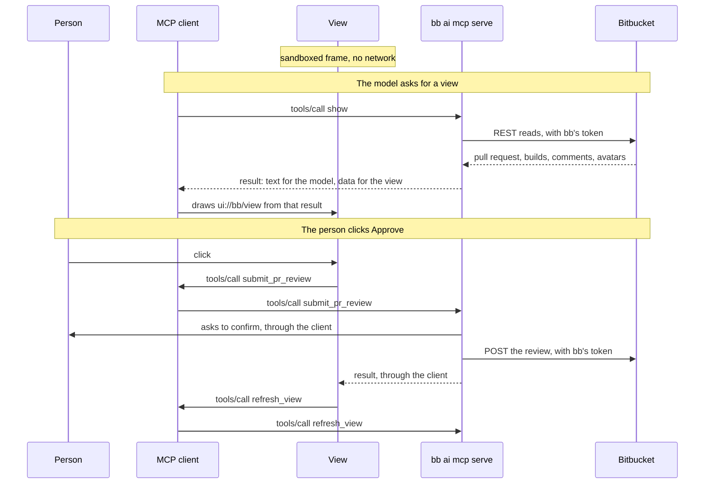

# MCP Server Governance

`bb` includes a built-in Model Context Protocol (MCP) server for integration with AI developer tools (VS Code Agent, Cursor, Claude Desktop).

## Tools That Ask, and a Read-Only Server
Every tool is exposed, and the ones that decide whether code merges ask the person before they run ([ADR-098](../adr/098-mcp-tools-that-decide-a-merge-ask-the-person.md)):

- **Ask before every call**: `merge_pull_request` and `enable_auto_merge`, which merge now or later; `disable_auto_merge`, which changes when a pull request merges; `submit_pr_review` and `set_build_status`, which feed the checks that decide whether a merge is allowed; and `create_tag`, which release pipelines act on. `update_pull_request` asks when a call sets the draft flag. An agent cannot approve a pull request without the person confirming it.
- **Run when called**: every read tool, and the writes that decide nothing about a merge: `create_pull_request`, `add_pr_comment`, and `update_pull_request` for a title or a description.

The confirmation is an MCP elicitation: the client shows what the call will do, and the tool acts only when the person accepts. A client that cannot show one gets error -32021 for those tools, and nothing reaches Bitbucket. Whether a client puts the question to the person or answers it itself, through a hook or an automatic approval, is the client's decision, so this control is as strong as the client you choose.

For a client you do not trust with the tool annotations and those confirmations, start the server with `--read-only`, which exposes only the tools that read. A client that cannot be trusted with them should not make changes in Bitbucket; make them yourself.

An administrator can decide this for every client on a machine. `read_only: true` in system policy starts every server read-only whatever its client configuration says, and `disable_mcp_server: true` refuses to start one at all ([ADR-100](../adr/100-administrators-can-switch-bb-off-or-make-it-read-only.md)).

The [MCP tool reference](../reference/mcp-tools.md) lists every tool with what it can change and whether it asks:
```bash
bb ai mcp tools
```

## Dedicated Read-Only Token Scoping
Never run IDE MCP servers under personal developer credentials. Generate a dedicated read-only PAT and bind the MCP server to it:

```bash
# Give the agent its own PAT through the MCP client's env block:
#   "env": { "BITBUCKET_TOKEN": "${BB_MCP_TOKEN}" }
# The ${VAR} form keeps it out of the config file, and lets the agent run on a
# read-only token while your own shell keeps a wider one.
bb ai mcp serve --host https://bitbucket.example.com
```

## Workspace Scoping

The PAT the server runs under bounds what an agent may *do*; `--project` and `--repo` bound *where* ([ADR-062](../adr/062-mcp-workspace-scoping-and-agent-audit-trail.md)). On a multi-tenant instance a read-only PAT still reaches every repository its owner can read, which for most developers is most of the organisation.

```bash
bb ai mcp serve --host https://bitbucket.example.com --project PAYMENTS
```

```bash
bb ai mcp serve --host https://bitbucket.example.com --repo PAYMENTS/ledger
```

Scoping is enforced at a single choke point over every tool call, resource read, prompt and completion, not per tool. Three behaviours are worth knowing before you configure it:

- **Omitted arguments are bound, not rejected.** `list_pull_requests` with no project reaches every repository the token can see. Under a scope the arguments are filled in, so the unbounded mode becomes the bounded one and the agent never needs to know.
- **Conflicting arguments are refused.** A call naming another project fails with an error the agent can read and correct.
- **Resources follow the same boundary.** A resource outside the scope is refused, the resource list holds only what is inside it, and completions suggest only the scoped project and repository. `--tools` and `--exclude` decide them too: a resource is served while the tool it answers like is exposed.
- **Tools that cannot be bounded are withheld entirely.** `get_build_status` and `set_build_status` address a commit SHA, which Bitbucket does not scope to a project. They disappear from `tools/list` while a scope is set. `search_repositories` is withheld under `--repo` for the same reason: pinning its project filter would still list sibling repositories, and a filter is not a boundary.

## Agent Audit Trail

`--audit-file` appends one JSON Lines record per tool call, for SIEM collection:

```bash
bb ai mcp serve --host https://bitbucket.example.com --project PAYMENTS --audit-file /var/log/bb/mcp-audit.jsonl
```

```json
{"timestamp":"2026-08-29T09:30:00Z","event":"mcp_tool_invocation","tool":"get_pull_request","project":"PAYMENTS","repo":"ledger","status":"success","duration_ms":45,"user_identity":"alice","host":"https://bitbucket.example.com","scope":"PAYMENTS"}
```

`status` is `success`, `error`, `denied`, or `asked`. A tool that asks adds `confirmation`: `accepted`, `declined`, `cancelled`, or `unavailable` when the client could not show the confirmation. A call the confirmation stops is also `denied`, including one whose answer the server cannot use, which records no `confirmation`. A client that sends the answer as a second call, as the 2026-07-28 revision does, leaves two records: `asked`, when the tool puts the question, having read from Bitbucket what it asks about, and the decision when the answer comes back. A question nobody answers is the `asked` record alone. An older client is asked within the one call, which is one record:

A view the agent put in front of the person keeps itself current while it is on screen by calling `refresh_view`, every 15 seconds while a build runs and less often the longer nothing changes, and the pull request form calls `suggest_form_values` as the person types and picks branches. Both read only, and each call is a record like any other; `--exclude refresh_view` keeps views as they were drawn. What the person does in a view, a comment, a review or a pull request, is a call of the model's own tool, `add_pr_comment`, `submit_pr_review`, `create_pull_request` or `update_pull_request`, recorded and confirmed as any call of it is.

Resource reads, the resource list and prompts are recorded too, as `mcp_resource_read`, `mcp_resource_list` and `mcp_prompt_get`, with `resource` or `prompt` in place of `tool`. Completions, which a client sends as the person types, are not, and neither are the lists of tools, resource templates and prompts, which read nothing from Bitbucket:

```json
{"timestamp":"2026-08-29T09:32:40Z","event":"mcp_resource_read","resource":"bitbucket://projects/PAYMENTS/repos/ledger/pull-requests/42/diff","project":"PAYMENTS","repo":"ledger","status":"success","duration_ms":61,"user_identity":"alice","host":"https://bitbucket.example.com","scope":"PAYMENTS"}
```

A declined confirmation looks like this:

```json
{"timestamp":"2026-08-29T09:31:12Z","event":"mcp_tool_invocation","tool":"merge_pull_request","project":"PAYMENTS","repo":"ledger","status":"denied","confirmation":"declined","duration_ms":14,"user_identity":"alice","host":"https://bitbucket.example.com","scope":"PAYMENTS","arguments":{"pr_id":"42","project":"PAYMENTS","repo":"ledger"},"error_message":"merge_pull_request did not run: the person declined. Do not call it again unless they ask"}
```

Argument values, resource URIs and error messages are recorded, with tokens, passwords and URL credentials redacted: an argument named for a secret entirely, and anywhere else a credential appears in the text, such as a URL with a password in it or `token=` in a ref. When the client sends W3C trace context, `trace_id` carries it so a record correlates with the agent's own trace.

Auditing is **off by default** — a developer who never turns it on should not accumulate a log file they will not find. Turn it on by fleet policy, not by asking developers to.

**Why audit here when Bitbucket already has an audit log.** The two answer different questions, and the CLI one is not a duplicate:

- **Attribution.** Every MCP call arrives at Bitbucket as the same user with the same PAT. Bitbucket cannot distinguish a developer reviewing a PR in a browser from an agent acting autonomously in their IDE. That distinction exists only here.
- **Denied attempts.** A call refused by the scope boundary, or by a person declining it, **never reaches Bitbucket**, so its audit log has no record of it. Attempted-and-blocked is precisely the prompt-injection signal worth alerting on: one successful read is noise, forty denied cross-project reads in ten seconds is an incident.
- **Reads in practice.** Bitbucket's repository read events sit at *Full* coverage, which most operators do not run in production because of volume. "Bitbucket already logs everything" holds far better for writes than for reads — and an exfiltrating agent is doing reads.

Bitbucket's audit log remains authoritative for what actually changed. Correlate the two on `(timestamp, user_identity)`.

**Two limitations to state plainly.**

*This log is not tamper-evident.* It is written on the developer's machine, as the developer, to a path they can edit. Against a determined insider it proves nothing. Against a prompt-injected agent confined to MCP tools — the ADV-3 threat it is designed for — it holds, because that agent has no shell.

*An agent with shell access can bypass all of this.* Nothing stops it running `bb pr merge` directly, or any other command in the CLI, none of which are scoped, gated, or audited. That is not a gap this feature can close: an agent that can run shell commands can also edit the audit file. **The control that survives it is the token the server runs under**, because a read-only PAT binds at the Bitbucket server and does not care which local process made the call. Treat MCP scoping and auditing as defence in depth over a correctly scoped token, never as a substitute for one.

## Mandating Audit by Policy

An audit destination a developer can change by editing their IDE config records only what they permit. Mandate it machine-wide instead ([ADR-058](../adr/058-system-wide-configuration-and-policy-enforcement.md)):

```yaml
# /etc/bb/config.yaml  (or %ProgramData%\bb\config.yaml)
policy:
  mcp_audit_file: /var/log/bb/mcp-audit.jsonl
```

The server then audits whether or not `--audit-file` is passed, and refuses a `--audit-file` pointing anywhere else with an authorization error.

**The mandate is worth what the policy file's permissions are worth.** `bb` reads the system configuration file and never creates the directory holding it, which is deliberate — see [ADR-058](../adr/058-system-wide-configuration-and-policy-enforcement.md), point 5. On Linux and macOS creating `/etc/bb/` already requires root. On Windows it does not: `C:\ProgramData` lets any account add a subdirectory and hands its creator full control of it, so `C:\ProgramData\bb` must be created by an administrator, before any developer runs `bb`, with unprivileged accounts left read access only. Until that is done, "the developer cannot redirect this" is not a claim you can make on a Windows workstation.

`mcp_audit_file` is also the one policy setting with no `HKLM\Software\Policies\bb` value, so on Windows it is set through the file and not by GPO. The registry is the stronger channel for everything it does carry.

When a record cannot be written the call is **refused**. An audit trail that silently stops recording is worse than none, because the absence of a record then carries no information. `--audit-failure=warn` relaxes this for an operator who would rather lose records than lose the server.

**Collection.** The audit log is a file because every SIEM already tails files — Splunk Universal Forwarder, Datadog Agent, Fluent Bit, Vector, Filebeat. `bb` deliberately ships no direct SIEM integration: it would put a network call, an auth secret and retry buffering inside the tool-call path of a process that is spawned per IDE session and killed without warning. For a containerised or wrapper-managed deployment, pass `--audit-file stderr` and let the cluster log collector read the process streams. Rotation is the collector's job; `bb` appends and never truncates.

## Views Stay Inside the MCP Server

A view is not a web page that talks to Bitbucket. It is drawn from the result
of a tool call, and everything it does is another tool call, through the MCP
client to this server ([ADR-101](../adr/101-mcp-server-adopts-mcp-apps.md)):

- **Drawn from a result.** The client reads the one page every view renders in, `ui://bb/view`, from bb as an MCP resource, and draws it in a sandboxed frame. The page holds no Bitbucket data. What a view shows arrives inside the result of the `show` call that asked for it, which bb read from Bitbucket with its own token, CA bundle, client certificate and proxy, avatars included.
- **No network.** The page declares no domains, so the client gives its frame no network at all. It cannot reach Bitbucket, a CDN or anything else, and it never holds a token.
- **Clicks are tool calls.** **Approve**, **Request changes**, **Reply**, **Comment** and **Create** call the model's own tools, `submit_pr_review`, `add_pr_comment`, `create_pull_request` and `update_pull_request`, through the client, as the model's calls go. The token's permissions, the scope, the audit record and the confirmation of a tool that asks apply to them as to the model. Keeping a view current calls `refresh_view`, and the form's suggestions call `suggest_form_values`: both read only, and offered to views and not to the model.
- **Links leave through the client.** A link opens in the person's browser, where Bitbucket's own login and permissions apply.



There is no other channel: the view reaches nothing the client does not pass on, and nothing reaches Bitbucket but bb. `--exclude show` turns views off, with the tools only views call. `--read-only` leaves the views that read and takes away their buttons and the form, whose tools write.

## Recommended IDE Configuration (`.vscode/settings.json`)

```json
{
  "mcp": {
    "servers": {
      "bitbucket": {
        "type": "stdio",
        "command": "bb",
        "args": [
          "ai",
          "mcp",
          "serve",
          "--host",
          "https://bitbucket.example.com",
          "--tools",
          "get_pull_request,list_pull_requests,get_pr_diff,list_pr_comments,add_pr_comment"
        ],
        "env": {
          "BITBUCKET_TOKEN": "${env:BITBUCKET_RO_TOKEN}",
          "BB_CA_FILE": "/Library/Application Support/Corporate/Certs/corp-root-ca.pem"
        }
      }
    }
  }
}
```


