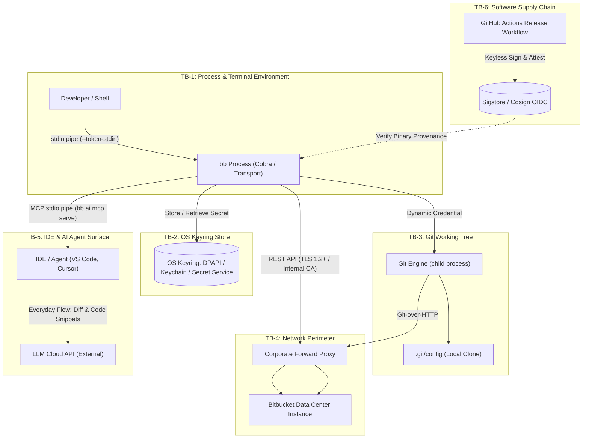

# Security Architecture and Threat Model

A formal security architecture, trust boundary analysis, and threat model for Chief Information Security Officers (CISOs), enterprise security architects, and compliance auditors evaluating `bb` (Bitbucket Data Center CLI).

---

## Document Metadata

| Field | Value |
|---|---|
| **Document Version** | 1.1.0 |
| **Target System** | `bb` (Bitbucket Data Center CLI) v2.10.x+ |
| **Classification** | Public Security & Threat Analysis Whitepaper |
| **Methodology** | STRIDE (Spoofing, Tampering, Repudiation, Information Disclosure, Denial of Service, Elevation of Privilege) |
| **Effective Date** | August 2026 |
| **Review Cadence** | Annual, or upon major architectural revision |

### Scope & System Boundaries

- **In-Scope**: The `bb` compiled binary runtime, local process execution, operating system keyring integration, Git credential helper protocol, local repository manipulation, network transport (TLS 1.2+, proxy traversal, custom CA handling), built-in MCP server (`bb ai mcp serve`), and release artifact distribution.
- **Out-of-Scope**: Bitbucket Data Center server-side zero-day vulnerabilities, host operating system kernel compromise / rootkit, and the external data handling / privacy practices of third-party cloud LLM providers connected to developer IDEs.

---

## 1. Asset Inventory & Adversary Model

### Assets to Protect

| Asset ID | Asset Name | Description | Sensitivity |
|---|---|---|---|
| **A-1** | **Authentication Credentials** | Personal Access Tokens (PATs) and HTTP Basic credentials used to authenticate API and Git operations. | **Critical** (Confidentiality & Integrity) |
| **A-2** | **Source Code & Working Trees** | Proprietary source code in cloned repositories, working tree diffs, pull request comments, and file contents. | **High** (Confidentiality & Integrity) |
| **A-3** | **Repository Gate Integrity** | Pull request review approvals, branch merge gates, and commit history on the Bitbucket server. | **High** (Integrity) |
| **A-4** | **Executable Integrity** | Authenticity and provenance of the compiled `bb` binary running on developer workstations. | **Critical** (Integrity) |

### Adversary Profiles

| Adversary | Description | Access Level & Capabilities |
|---|---|---|
| **ADV-1: Local Unprivileged User** | Multi-user jump host user, malicious developer, or unprivileged local background process. | Can read `/proc/<pid>/cmdline`, process table (`ps aux`), unencrypted filesystem paths, and user environment variables. |
| **ADV-2: Network Interceptor** | Man-in-the-Middle (MitM) attacker on local network, untrusted forward proxy, or compromised DNS. | Can intercept, inspect, or tamper with outbound network traffic if TLS validation is absent or compromised. |
| **ADV-3: Prompt-Injected AI Agent** | Autonomous AI developer tool (Cursor, VS Code Agent) manipulated via indirect prompt injection in pull request diffs or comments. | Can invoke exposed Model Context Protocol (MCP) tools over stdio to read data or trigger mutations. |
| **ADV-4: Upstream Supply Chain Attacker** | Adversary targeting upstream dependencies, build runners, or release distribution channels. | Can attempt to inject malicious code into dependencies or tamper with published release archives. |

---

## 2. System Architecture & Trust Boundaries

The following architecture diagram models all six trust boundaries across the workstation, local repositories, corporate network, IDE AI integration, and build pipeline:



### Trust Boundary Definitions

| Boundary | Components | Trust Level | Security Invariants |
|---|---|---|---|
| **TB-1: Process & Terminal** | `bb` runtime process, memory, arguments, stdout/stderr | Trusted Local User | Zero secret leakage in process argument table (`/proc/<pid>/cmdline`). Zero telemetry. |
| **TB-2: OS Keyring Store** | Windows Credential Manager, macOS Keychain, Linux Secret Service | System Security Enclave | Secrets held encrypted at rest. Immediate failure if plaintext fallback is needed when `BB_REQUIRE_KEYRING=1` is set. |
| **TB-3: Git Working Tree** | Local git clone, `.git/config`, `git` CLI child processes | Semi-Trusted Filesystem | Zero credentials persisted into repository `.git/config`. Host-scoped credential querying. |
| **TB-4: Network Perimeter** | Corporate forward proxies, internal enterprise PKI, Bitbucket DC | Untrusted / Inspected Network | Minimum TLS 1.2. Additive corporate CA trust pool. Strict non-interactive timeout enforcement. |
| **TB-5: AI / MCP Surface** | IDE agent (Cursor, VS Code, Claude Desktop), stdio RPC pipe | Constrained Automation | Safe-by-default tool gating. Unsafe tools withheld without explicit `--yolo`. Dedicated read-only tokens. |
| **TB-6: Supply Chain** | GitHub Actions builder, release packaging, Sigstore/Cosign | Cryptographic Verification | Keyless OIDC signatures, SLSA build provenance attestations, attested SPDX 2.3 SBOM. |

---

## 3. The Everyday Source-Code-to-LLM Data Flow

A primary question in enterprise security evaluations of AI-enabled developer tooling is: **what proprietary data leaves the workstation, and to whom is it transmitted?**

### The MCP Channel Architecture
When `bb ai mcp serve` runs, it communicates strictly over standard input/output (`stdio`) with the local IDE process (e.g. VS Code, Cursor). 

```
[Bitbucket DC] ──(HTTPS/Internal CA)──> [bb CLI (Local)] ──(stdio RPC)──> [Local IDE] ──(HTTPS/IDE Config)──> [Cloud LLM]
```

1. **Local CLI Boundary**: `bb` sends **zero external telemetry** and initiates no network requests to AI providers. Its network calls are strictly directed to your Bitbucket server.
2. **The Stdio Pipe**: When an AI agent executes tools like `get_pr_diff`, `get_pull_request`, or `list_pr_comments`, `bb` fetches the data from Bitbucket and prints structured JSON to `stdout`.
3. **The IDE & Cloud LLM Transmission**: The IDE consumes this output and includes the source code diffs in prompt contexts sent to the developer's configured LLM provider (e.g. OpenAI, Anthropic, or internal corporate Ollama/vLLM endpoints).

### Hardening the By-Design Flow
To govern this everyday flow:
- **Dedicated Read-Only Token**: Bind `bb ai mcp serve` to a service token with read-only rights (`--token <ro-pat>`), ensuring the agent cannot execute mutations on the Bitbucket server even if prompted.
- **Explicit Tool Allowlists**: Constrain exposed tools using `--tools get_pull_request,list_pull_requests,get_pr_diff,list_pr_comments,add_pr_comment`.
- **Egress Governance**: Outbound LLM network traffic is managed at the IDE layer (via corporate proxy, DLP filtering, or private Azure OpenAI / AWS Bedrock VPC endpoints).

---

## 4. Multi-OS Policy Enforcement Realities

Enterprise policy enforcement mechanisms differ across operating systems, unified under the multi-tier hierarchy ([ADR-058](../adr/058-system-wide-configuration-and-policy-enforcement.md)):

| Operating System | Fleet Tooling | Primary Policy Channel | Fallback Policy Channel | Enforcement Posture |
|---|---|---|---|---|
| **Windows** | Microsoft Intune / SCCM / Active Directory GPO | **Windows Registry (`HKLM\Software\Policies\bb`)** | System Config (`%ProgramData%\bb\config.yaml`) | **High**. Unprivileged users cannot modify `HKLM\Software\Policies`. Registry policy takes immutable precedence over user environment variables and user configuration files. |
| **macOS** | Jamf Pro, Kandji, Apple MDM | **System Config (`/etc/bb/config.yaml`, `chmod 644 root:wheel`)** | System Shell Profiles (`/etc/zshenv`) | **High**. Read directly by the `bb` binary across both terminal shells and GUI parent processes (such as IDE-launched MCP servers). |
| **Linux (Workstations)** | Ansible, Puppet, SaltStack, Red Hat Satellite | **System Config (`/etc/bb/config.yaml`, `chmod 644 root:root`)** | Shell Environment (`/etc/profile.d/bb.sh`) | **High**. Standard root-owned system configuration. Immutable by non-root users on developer workstations and multi-user jump hosts. |
| **Linux (CI Runners)** | Kubernetes, Docker, Runner Daemons | Ephemeral Environment Variables (`BITBUCKET_TOKEN`, `BB_DISABLE_STORED_CONFIG=1`, `BB_DISABLE_UPDATE=1`) | Baked Container Image `/etc/bb/config.yaml` | **High**. Containers lack desktop keyrings; `BB_DISABLE_STORED_CONFIG=1` guarantees zero stored credential reads and zero keyring daemon access. |

---

## 5. STRIDE Threat Domain Analysis

Each domain is analyzed using the **Threat (STRIDE) ↔ Architectural Mitigation ↔ Audit Test Procedure ↔ Residual Gap** triad.

---

### Domain 1: Secret Hygiene & Storage at Rest (TB-1 & TB-2)

#### 1. Threat Analysis (STRIDE: Information Disclosure)
- **Attacker Vector (ADV-1)**: Unprivileged local users, compromised background processes, or EDR agents scrape secrets passed via CLI flags (`--token <val>`) through `ps aux` or `/proc/<pid>/cmdline`.
- **Plaintext Fallback Risk**: If an OS keyring is unavailable, CLI tools may silently fall back to unencrypted disk files:
  - Linux: `~/.config/bb/config.yaml`
  - macOS: `~/Library/Application Support/bb/config.yaml`
  - Windows: `%AppData%\bb\config.yaml`

#### 2. Architectural Mitigations
- **Mandatory Stdin Ingestion**: `bb auth login` supports `--token-stdin` and `--password-stdin`, reading secrets strictly over standard input.
- **Process Table Warning**: Supplying `--token` or `--password` as CLI flags prints an explicit warning to `stderr` alerting the operator ([ADR-047](../adr/047-credential-input-and-keyring-enforcement.md)).
- **Enforced Keyring Storage**: Setting `require_keyring: true` in system configuration or Windows Registry `HKLM\Software\Policies\bb` hard-refuses plaintext fallback machine-wide and cannot be bypassed by unprivileged users unsetting environment variables ([ADR-058](../adr/058-system-wide-configuration-and-policy-enforcement.md)). Advisory `BB_REQUIRE_KEYRING=1` remains supported for ad-hoc user environments.
- **Headless Disabling**: Setting `BB_DISABLE_STORED_CONFIG=1` in CI/CD completely skips stored config reads and keyring access, reading solely from `BITBUCKET_TOKEN`.

#### 3. Audit Test Procedure
```bash
bb auth status --json
```
*Audit Assertion*: Verify that `.data.credential_storage` equals `keyring` (on workstations) or `environment` (in CI runners), and never `config-file-plaintext`.

#### 4. Residual Gap & Tracking
- **Resolution**: Fully resolved via system-wide configuration (`/etc/bb/config.yaml`, `%ProgramData%\bb\config.yaml`) and Windows Registry policy (`HKLM\Software\Policies\bb`) with `require_keyring: true` ([ADR-058](../adr/058-system-wide-configuration-and-policy-enforcement.md), [Issue #420](https://github.com/vriesdemichael/bitbucket-data-center-cli/issues/420)). Plaintext fallback cannot occur when mandated by machine policy.

---

### Domain 2: Git Transport & Repository Boundaries (TB-3)

#### 1. Threat Analysis (STRIDE: Information Disclosure, Elevation of Privilege)
- **Attacker Vector (ADV-1, ADV-2)**: Persisting tokens into `.git/config` (via legacy `http.extraHeader`) leaks credentials whenever repositories are archived, copied, or pushed. Furthermore, an unscoped `http.extraHeader` is transmitted to any HTTP remote, leaking internal Bitbucket tokens to external remotes.

#### 2. Architectural Mitigations
- **Host-Scoped Credential Helper**: `bb auth setup-git` writes a credential helper rule scoped strictly to the Bitbucket hostname into the global `~/.gitconfig` ([ADR-044](../adr/044-git-credential-helper-instead-of-persisted-credentials.md)):
  ```ini
  [credential "https://bitbucket.example.com"]
  	helper = !"/usr/local/bin/bb" auth git-credential
  ```
- **Zero Repository Footprint**: Cloned repositories contain zero credentials or tokens in their local `.git/config`.
- **Instant Revocation**: If a token is revoked in Bitbucket or removed via `bb auth logout`, all local clones immediately lose access without requiring manual git cleanup.

#### 3. Audit Test Procedure
```bash
git config --local --get http.extraHeader
```
*Audit Assertion*: Command exits with non-zero status (no extra headers found).

---

### Domain 3: Network Perimeter, Proxies & Internal PKI (TB-4)

#### 1. Threat Analysis (STRIDE: Information Disclosure, Tampering)
- **Attacker Vector (ADV-2)**: Interception proxies re-signing traffic using internal enterprise root CAs cause certificate trust failures. Developers may attempt to bypass errors using `--insecure-skip-verify`.

#### 2. Architectural Mitigations
- **Additive Corporate CA Trust Pool**: `BB_CA_FILE` appends the internal CA bundle to `x509.SystemCertPool()`, preserving public root verification while trusting the internal Bitbucket host.
- **Proxy Traversal**: Inherits `HTTPS_PROXY`, `HTTP_PROXY`, and `NO_PROXY` directly from Go's `http.DefaultTransport`.
- **TLS 1.2+ Enforced**: Pinned minimum version `tlsConfig.MinVersion = tls.VersionTLS12`.
- **Zero Telemetry**: Guaranteed zero external analytics or metrics calls ([SECURITY.md](https://github.com/vriesdemichael/bitbucket-data-center-cli/blob/main/SECURITY.md)).

#### 3. Audit Test Procedure
```bash
bb --log-level debug --log-format jsonl repo list --limit 1
```
*Audit Assertion*: Verify that the connection succeeds over TLS 1.2+ and routes through the designated `HTTPS_PROXY`.

#### 4. Residual Gap & Tracking
- **Limitation**: In zero-trust networks requiring client certificates at the TLS layer before reverse proxy ingress, `bb` cannot authenticate because it lacks mutual TLS (mTLS) client certificate support.
- **Tracked Issue**: **[Issue #422: feat: mutual TLS (mTLS) client certificate support](https://github.com/vriesdemichael/bitbucket-data-center-cli/issues/422)**.

---

### Domain 4: Autonomous AI & MCP Server Governance (TB-5)

#### 1. Threat Analysis (STRIDE: Tampering, Elevation of Privilege, Information Disclosure)
- **Attacker Vector (ADV-3)**: Prompt injection in pull request diffs or comments manipulates an AI agent into performing destructive mutations (approving unauthorized PRs, merging unvetted code, modifying build status) or querying sensitive repositories across unrelated projects.

#### 2. Architectural Mitigations
- **Safe vs. Unsafe Tool Isolation**: High-impact mutating operations (`submit_pr_review`, `merge_pull_request`, `enable_auto_merge`, `set_build_status`) are withheld by default ([ADR-039](../adr/039-built-in-mcp-server-with-host-scoping-and-token-restriction.md)). Crucially, withholding `submit_pr_review` prevents an agent from self-approving its own pull requests.
- **Dedicated Read-Only Token Scoping**: Running `bb ai mcp serve --token <ro-pat>` forces the MCP server to execute under a service token with read-only server rights.
- **Explicit Capability Allowlists**: Constraining exposed tools via `--tools` or `--exclude`.

#### 3. Audit Test Procedure
```bash
bb ai mcp tools
```
*Audit Assertion*: Confirm that unsafe tools are marked as withheld unless explicitly authorized.

#### 4. Residual Gap & Tracking
- **Limitation**: `bb ai mcp serve` scopes to the entire Bitbucket server instance. Agents cannot be restricted to a single project or repository, and stdio RPC lacks a dedicated SIEM audit stream.
- **Tracked Issue**: **[Issue #423: feat: MCP server workspace scoping and audit logging](https://github.com/vriesdemichael/bitbucket-data-center-cli/issues/423)**.

---

### Domain 5: Supply Chain & Software Distribution (TB-6)

#### 1. Threat Analysis (STRIDE: Tampering)
- **Attacker Vector (ADV-4)**: Compromised build runners, malicious upstream dependencies, or tampered release packages could introduce backdoors into developer environments. Additionally, running `bb update` on managed machines bypasses package managers and change approval boards.

#### 2. Architectural Mitigations
- **Sigstore / Cosign Keyless Signing**: Releases are signed via OIDC identity bound to `.github/workflows/release.yml@refs/heads/main`.
- **GitHub Build Provenance**: Provenance attestations verifiable via `gh attestation verify`.
- **Attested SPDX 2.3 SBOM**: Every release publishes `sbom.spdx.json`, attested against each compiled binary.

#### 3. Audit Test Procedure
```bash
VERSION="[[ bb_version ]]"
cosign verify-blob \
  --bundle "bb_${VERSION}_linux_amd64.tar.gz.sigstore.json" \
  --certificate-identity 'https://github.com/vriesdemichael/bitbucket-data-center-cli/.github/workflows/release.yml@refs/heads/main' \
  --certificate-oidc-issuer 'https://token.actions.githubusercontent.com' \
  "bb_${VERSION}_linux_amd64.tar.gz"
```

#### 4. Residual Gap & Tracking
- **Resolution**: Fully resolved via administrative killswitches (`BB_DISABLE_UPDATE=1`, `disable_update: true` in system configuration), compile-time removal (`-tags no_self_update`), and custom release mirror support (`--base-url`, `BB_UPDATE_BASE_URL`, `update_base_url`) ([ADR-059](../adr/059-enterprise-update-controls-and-release-mirrors.md), [Issue #421](https://github.com/vriesdemichael/bitbucket-data-center-cli/issues/421)).

---

### Domain 6: Enterprise Identity & Federation (SSO)

#### 1. Threat Analysis (STRIDE: Spoofing, Elevation of Privilege)
- **Attacker Vector (ADV-1)**: Static personal access tokens with infinite lifespans escape centralized IdP lifecycle de-provisioning.

#### 2. Architectural Mitigations
- **Scoped TTL Tokens**: `bb auth token create --expiry-days <N>` supports time-bound tokens.
- **Immediate Invalidation**: Tokens revoked in Bitbucket Server immediately invalidate all CLI and git operations.

#### 3. Audit Test Procedure
```bash
bb auth token list
```

#### 4. Residual Gap & Tracking
- **Limitation**: Bitbucket Data Center ships with zero configured OAuth clients, and non-admin users cannot create them. Enabling a browser OAuth flow requires extensive server-administrator changes.
- **Tracked Issue**: **[Issue #424: feat: opt-in OAuth 2.0 browser login for enterprise SSO](https://github.com/vriesdemichael/bitbucket-data-center-cli/issues/424)**.

---

## 6. Compliance Matrix & Risk Treatment Plan

| Threat ID | Threat Description | Regulatory Mapping | Residual Risk | Risk Treatment | Test Procedure | Tracked Issue |
|---|---|---|---|---|---|---|
| **T-1** | Process table secret sniffing & plaintext disk fallback | SOC 2 CC6.1, ISO 27001:2022 A.8.24, NIST SP 800-53 AC-3 | **Low** | Fully mitigated via mandatory Keyring policy enforcement (`require_keyring: true`), system configuration tier, and stdin ingestion. | `bb auth status --json` | [#420](https://github.com/vriesdemichael/bitbucket-data-center-cli/issues/420) ([ADR-058](../adr/058-system-wide-configuration-and-policy-enforcement.md)) |
| **T-2** | Repository secret bleed & cross-remote credential leakage | SOC 2 CC6.6, ISO 27001:2022 A.8.12 | **Low** | Mitigated via host-scoped Git credential helper (`bb auth setup-git`). | `git config --local --get http.extraHeader` | — |
| **T-3** | Inability to traverse mutual TLS (mTLS) ingress | NIST SP 800-207 (Zero Trust Architecture), SC-8 | **Medium** | Backlog feature; requires client cert/key flags in transport. | `bb repo list` behind mTLS | [#422](https://github.com/vriesdemichael/bitbucket-data-center-cli/issues/422) |
| **T-4** | Prompt-injected AI agent executing unauthorized mutations | OWASP Top 10 LLM (2025 LLM01, LLM06), SOC 2 CC6.8 | **Medium** | Mitigate via safe/unsafe tool withholding; requires workspace bounding & audit logging. | `bb ai mcp tools` | [#423](https://github.com/vriesdemichael/bitbucket-data-center-cli/issues/423) |
| **T-5** | Unmanaged binary updates breaking package manager state | ISO 27001:2022 A.8.19, NIST SP 800-53 SI-2 | **Low** | Fully mitigated via `BB_DISABLE_UPDATE=1`, system config `disable_update: true`, build tag `no_self_update`, and internal release mirror resolution. | `bb update` on managed machine | [#421](https://github.com/vriesdemichael/bitbucket-data-center-cli/issues/421) ([ADR-059](../adr/059-enterprise-update-controls-and-release-mirrors.md)) |
| **T-6** | Unfederated static token lifecycle management | CIS Controls v8 5.4 / 6.1, NIST SP 800-63B | **Medium** | Mitigate via scoped TTL PATs; browser flow requires Bitbucket DC admin configuration. | `bb auth token list` | [#424](https://github.com/vriesdemichael/bitbucket-data-center-cli/issues/424) |

---

## 7. Security Invariants Summary

- **Strict Non-Interactive CLI Contract ([ADR-054](../adr/054-strict-non-interactive-cli-contract.md))**: `bb` never prompts on stdin for confirmation or surveys, guaranteeing zero hanging processes in automation or CI/CD pipelines.
- **Zero External Telemetry ([SECURITY.md](https://github.com/vriesdemichael/bitbucket-data-center-cli/blob/main/SECURITY.md))**: `bb` sends no telemetry, metrics, or usage statistics to any third-party server.
- **Structured Error Taxonomy ([ADR-011](../adr/011-error-taxonomy-and-cli-exit-contract.md), [ADR-046](../adr/046-json-error-envelope-on-the-failure-path.md))**: Fatal failures emit a predictable JSON error envelope with categorized error taxonomy (`validation`, `auth`, `not_found`, `conflict`, `system`).
