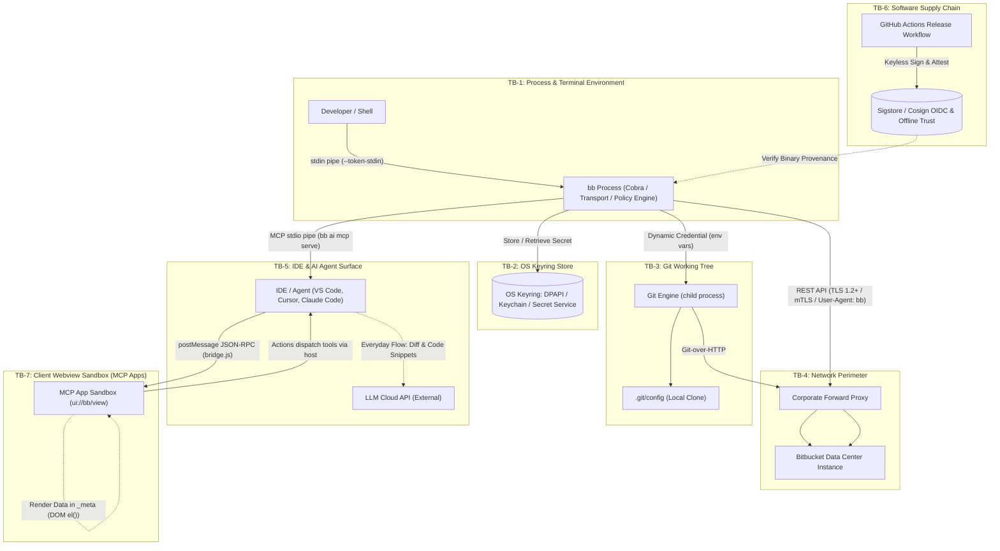

# Security Architecture and Threat Model

A formal security architecture, trust boundary analysis, and threat model for Chief Information Security Officers (CISOs), enterprise security architects, and compliance auditors evaluating `bb` (Bitbucket Data Center CLI) version `v5.0.0` (`v5`).

---

## Document Metadata

| Field | Value |
|---|---|
| **Document Version** | 2.0.0 |
| **Target System** | `bb` (Bitbucket Data Center CLI — Full Product Scope) |
| **Evaluated Software Version** | `v5.0.0` (`v5` release milestone) |
| **Classification** | Public Security & Threat Analysis Whitepaper |
| **Methodology** | STRIDE (Spoofing, Tampering, Repudiation, Information Disclosure, Denial of Service, Elevation of Privilege) |
| **Effective Date** | October 2026 |
| **Review Cadence** | Annual, or upon major architectural revision |

### Scope & System Boundaries

- **In-Scope (Entire Product)**:
  - Local process execution, Cobra CLI command tree, interactive prompt detection, and exit status contracts.
  - Configuration discovery hierarchy: system policy files, Windows Registry, user configuration, repository `.bb/config.yaml`, environment variables, and repository-bounded `.env` walk-up.
  - Secret hygiene: operating system keyring integration (DPAPI, Keychain, Secret Service), plaintext fallback controls, credential masking, and argument parsing.
  - Git integration: `execgit` child process execution, host-scoped Git credential helper protocol (`bb auth git-credential`), and subprocess environment passing.
  - Network transport: TLS 1.2+ enforcement, corporate CA bundle injection (`BB_CA_FILE`), mutual TLS client certificates (`--client-cert`/`--client-key`), proxy handling (`HTTPS_PROXY`), structured `User-Agent` attribution, stall-timed streaming downloads, and raw API escape hatches (`bb api`).
  - Bitbucket Data Center compatibility layer: server capability detection and proactive refusal of silently dropped security constraints across Bitbucket 9.2+.
  - Autonomous AI integration: built-in Model Context Protocol server (`bb ai mcp serve`), stdio JSON-RPC transport, tool allowlisting/denylisting, workspace scoping (`--project`/`--repo`), human-in-the-loop elicitation confirmations with HMAC-signed request states and PR version pinning, and SIEM JSONL audit logging.
  - MCP resource engine: attachable Bitbucket content (`bitbucket://...`), resource templates, prompts, and dynamic completion scoping.
  - Client webview rendering: MCP Apps interactive UI (`ui://bb/view`), zero-network CSP sandboxing, pure programmatic DOM construction (`el()`), custom sandboxed Markdown parser, credentialed server-side avatar proxying, and bridge action dispatch.
  - Content decoders: repository file reading (`get_file_content`), Office Open XML parsing, archive listing, image dimension pre-checks and scaling, audio/video pass-through, and text windowing.
  - Software supply chain & distribution: keyless Sigstore/Cosign OIDC signing, GitHub SLSA build provenance attestations, SPDX 2.3 SBOM generation, in-process atomic self-update engine (`bb update`), offline trust roots, and administrative update killswitches.
  - Fleet governance: immutable administrative policy levers (`disable_bb`, `disable_mcp_server`, `read_only`, `require_keyring`, `allow_insecure_skip_verify`, `allow_http_update`, `disable_update`, `mcp_audit_file`).
- **Out-of-Scope**:
  - Bitbucket Data Center server-side zero-day vulnerabilities, remote code execution flaws, or database compromises on the Atlassian server itself.
  - Host operating system kernel compromise, rootkits, or hypervisor escapes.
  - The internal data handling, retention, training, or privacy policies of third-party cloud LLM providers (e.g. OpenAI, Anthropic) connected to developer IDEs.
  - Compromises of the developer IDE or Electron runtime (e.g. VS Code, Cursor) that escape the webview sandbox or subvert the parent process memory.

---

## 1. Executive Summary & Security Philosophy

`bb` (evaluated at version `v5.0.0` / `v5`) is a single compiled Go binary designed for enterprise developers, CI/CD runners, and autonomous AI coding agents interacting with Bitbucket Data Center instances.

Enterprise security assessments of developer tooling frequently suffer from two false assumptions:
1. *Assuming client-side tools provide absolute authorization boundaries*: A command-line tool executed on a developer workstation or inside an IDE cannot be an absolute security barrier against the user running it or against a compromised process holding shell access. The Bitbucket Data Center server and the Personal Access Token (PAT) permissions remain the ultimate authority. Client-side controls exist to prevent accidental misconfigurations, eliminate inadvertent secret leakage, enforce enterprise fleet policies, and constrain automated AI agents that lack an interactive human shell.
2. *Relying on leniency or silent defaults*: In high-compliance environments, silent fallbacks create severe vulnerabilities. If a keyring fails, falling back to plaintext disk files without an explicit administrator mandate undermines compliance. If an older Bitbucket server ignores a required build check, accepting the command undermines repository gates. `bb` adheres strictly to **fail-closed, explicit, and audited** semantics.

This threat model documents both the controls `bb` provides and its **honest residual risks** — the exact boundaries where client-side mitigations end and platform controls must take over.

---

## 2. Asset Inventory & Criticality

| Asset ID | Asset Name | Description | Sensitivity |
|---|---|---|---|
| **A-1** | **Authentication Credentials** | Personal Access Tokens (PATs), HTTP Basic credentials, and mTLS private keys used to authenticate API, Git, and MCP operations. | **Critical** (Confidentiality & Integrity) |
| **A-2** | **Source Code & Working Trees** | Proprietary source code in local checkouts, diffs, pull request comments, and server repositories. | **High** (Confidentiality & Integrity) |
| **A-3** | **Repository Gate Integrity** | Pull request review approvals, branch merge gates, required build statuses, reviewer conditions, and commit history. | **High** (Integrity) |
| **A-4** | **Executable Integrity** | Authenticity, provenance, and tamper-resistance of the compiled `bb` binary running on workstations and CI runners. | **Critical** (Integrity) |
| **A-5** | **AI Model Context & Execution Bound Integrity** | Stability, memory safety, and token economics of the AI model and local MCP runtime when ingesting untrusted repository files, archives, office documents, or diffs. | **High** (Availability & Integrity) |
| **A-6** | **Client Webview & View Action Integrity** | Execution safety of interactive MCP Apps views in client webviews, preventing cross-site scripting (XSS), data exfiltration, and unauthorized mutation dispatch. | **High** (Confidentiality & Integrity) |
| **A-7** | **Enterprise Audit Trail & Attribution** | Local MCP JSONL audit records and server-side HTTP `User-Agent` attribution for SIEM ingestion and forensic review. | **Medium** (Integrity & Non-Repudiation) |

---

## 3. Adversary Profiles & Threat Agents

| Adversary | Description | Access Level & Capabilities |
|---|---|---|
| **ADV-1: Local Unprivileged User / Process** | Multi-user jump host user, malicious developer, or background process sharing the developer's machine. | Can read `/proc/<pid>/cmdline`, process table (`ps aux`), unencrypted filesystem paths, user environment variables, and shell history. |
| **ADV-2: Network Interceptor** | Man-in-the-Middle (MitM) attacker on local network, untrusted forward proxy, or compromised DNS. | Can intercept, inspect, or tamper with outbound network traffic if TLS validation is absent or compromised. |
| **ADV-3: Prompt-Injected Autonomous AI Agent** | Autonomous AI developer tool (Cursor, VS Code Agent, Claude Code) manipulated via indirect prompt injection in pull request diffs, issues, or comments. | Can invoke exposed Model Context Protocol (MCP) tools over stdio to read repository data or trigger mutations. Has **no direct terminal/shell access**. |
| **ADV-4: Shell-Capable AI Agent / Insider** | Autonomous coding harness or compromised developer process possessing terminal/shell execution privileges. | Can execute arbitrary shell commands, invoke `bb` directly, run `git`, read `/proc`, and modify unprivileged local configuration and audit files. |
| **ADV-5: Untrusted Repository Contributor** | External contributor or hostile insider submitting crafted pull requests, diffs, comments, branch names, or repository files. | Can submit decompression bombs, deeply nested XML, oversized images, or crafted markdown/HTML payloads targeting CLI parsers or webview renderers. |
| **ADV-6: Upstream Supply Chain Attacker** | Adversary targeting upstream Go dependencies, build runners, release distribution channels, or release mirrors. | Can attempt to inject malicious code into dependencies, tamper with published release archives, or serve forged update binaries. |

---

## 4. System Architecture & Trust Boundaries

The system encompasses seven distinct trust boundaries across developer workstations, local git clones, corporate networks, IDE AI agents, client webviews, and release pipelines:


```mermaid
flowchart TB
    subgraph TB1["TB-1: Process & Terminal Environment"]
        User["Developer / Shell"]
        CLI["bb Process (Cobra / Transport / Policy Engine)"]
        User -- "stdin pipe (--token-stdin)" --> CLI
    end

    subgraph TB2["TB-2: OS Keyring Store"]
        Vault[("OS Keyring: DPAPI / Keychain / Secret Service")]
        CLI -- "Store / Retrieve Secret" --> Vault
    end

    subgraph TB3["TB-3: Git Working Tree"]
        GitEngine["Git Engine (child process)"]
        RepoConfig[".git/config (Local Clone)"]
        CLI -- "Dynamic Credential (env vars)" --> GitEngine
        GitEngine --> RepoConfig
    end

    subgraph TB4["TB-4: Network Perimeter"]
        Proxy["Corporate Forward Proxy"]
        BBServer["Bitbucket Data Center Instance"]
        CLI -- "REST API (TLS 1.2+ / mTLS / User-Agent: bb)" --> Proxy --> BBServer
        GitEngine -- "Git-over-HTTP" --> Proxy --> BBServer
    end

    subgraph TB5["TB-5: IDE & AI Agent Surface"]
        IDE["IDE / Agent (VS Code, Cursor, Claude Code)"]
        LLMProvider["LLM Cloud API (External)"]
        CLI -- "MCP stdio pipe (bb ai mcp serve)" --> IDE
        IDE -. "Everyday Flow: Diff & Code Snippets" .-> LLMProvider
    end

    subgraph TB7["TB-7: Client Webview Sandbox (MCP Apps)"]
        Webview["MCP App Sandbox (ui://bb/view)"]
        IDE -- "postMessage JSON-RPC (bridge.js)" --> Webview
        Webview -. "Render Data in _meta (DOM el())" .-> Webview
        Webview -- "Actions dispatch tools via host" --> IDE
    end

    subgraph TB6["TB-6: Software Supply Chain"]
        GHA["GitHub Actions Release Workflow"]
        Sigstore[("Sigstore / Cosign OIDC & Offline Trust")]
        GHA -- "Keyless Sign & Attest" --> Sigstore
        Sigstore -. "Verify Binary Provenance" .-> CLI
    end
```

### Trust Boundary Definitions

| Boundary | Components | Trust Level | Security Invariants |
|---|---|---|---|
| **TB-1: Process & Terminal** | `bb` runtime process, memory, arguments, stdout/stderr, policy engine | Trusted Local User | Zero secret leakage in process argument table (`/proc/<pid>/cmdline`). Zero telemetry. Immutable administrative policy precedence (`disable_bb`, `read_only`). |
| **TB-2: OS Keyring Store** | Windows Credential Manager, macOS Keychain, Linux Secret Service | System Security Enclave | Secrets held encrypted at rest. Immediate failure if plaintext fallback is needed when `BB_REQUIRE_KEYRING=1` or `require_keyring: true` is set. |
| **TB-3: Git Working Tree** | Local git clone, `.git/config`, `git` CLI child processes | Semi-Trusted Filesystem | Zero credentials persisted into repository `.git/config`. Credentials passed to `git` through process environment. Host-bound credential querying. `.env` walk-up bounded by repository root. `--yes` never applies to inferred remotes. |
| **TB-4: Network Perimeter** | Corporate forward proxies, internal enterprise PKI, Bitbucket DC | Untrusted / Inspected Network | Minimum TLS 1.2. Additive corporate CA trust pool. Strict stall timeouts and bounded downloads ([ADR-093](../adr/093-binary-and-large-downloads-go-through-one-downloader.md)). Structured `User-Agent` disclosing client version and surface without PII. |
| **TB-5: AI / MCP Surface** | IDE agent (Cursor, VS Code, Claude Code), stdio RPC pipe | Constrained Automation | Merge-deciding tools require interactive human elicitation with HMAC-signed request states and PR version pinning ([ADR-098](../adr/098-mcp-tools-that-decide-a-merge-ask-the-person.md)). Dedicated read-only tokens. Redacted JSONL audit trail covering allowed, denied, and asked invocations. |
| **TB-6: Supply Chain** | GitHub Actions builder, release packaging, Sigstore/Cosign | Cryptographic Verification | Keyless OIDC signatures, SLSA build provenance attestations, attested SPDX 2.3 SBOM, offline Sigstore trust root support, atomic in-place binary swap with rollback ([ADR-092](../adr/092-bb-update-installs-the-new-binary-itself-before-it-exits.md)). |
| **TB-7: Client Webview Sandbox** | MCP Apps view runtime (`ui://bb/view`), client browser webview | Sandboxed Browser Context | Zero network permissions (`csp: {}`). Programmatic DOM generation (`el()`, text nodes only, no `innerHTML`). Markdown parser without raw HTML execution. Links restricted to `http`/`https` and delegated to host. View actions route to standard MCP tools through host bridge. |

---

## 5. End-to-End Data Flow Analyses

### DF-1: Developer Interactive Terminal Flow
```
Developer ──(stdin pipe / args)──> [bb CLI] ──(HTTPS/mTLS)──> [Corporate Proxy] ──> [Bitbucket DC]
```
- Secrets reach `bb` over stdin (`--token-stdin`, `--password-stdin`) or environment variables, never CLI flags.
- `bb` evaluates administrative policies (`disable_bb`, `read_only`) before executing commands.
- Mutating commands undergo dry-run preview evaluation under `--dry-run` ([ADR-034](../adr/034-unified-dry-run-planning-engine.md)).
- Output is rendered as human-friendly text, or machine-readable JSON/YAML envelopes ([ADR-046](../adr/046-json-error-envelope-on-the-failure-path.md), [ADR-095](../adr/095-machine-output-is-the-whole-envelope-as-json-or-yaml.md)) with sanitized error categories.

### DF-2: Git Transport & Subprocess Credential Flow
```
[Local Git Clone] ──(git push / fetch)──> [git Engine] ──(auth query)──> [bb auth git-credential] ──> [OS Keyring]
                                                │
[bb clone / pr checkout] ──(env: GIT_CONFIG_PARAMETERS)──┘
```
- `bb auth setup-git` configures a global Git credential helper scoped strictly to the Bitbucket hostname ([ADR-044](../adr/044-git-credential-helper-instead-of-persisted-credentials.md)).
- When `git` invokes `bb auth git-credential`, `bb` resolves credentials from the OS Keyring. If no credential exists for the queried host, it returns silence rather than falling back to credentials stored for other hosts.
- Operations that execute git directly (`bb clone`, `bb pr checkout`) inject authentication headers into the child process environment, leaving `.git/config` completely free of persistent tokens ([Issue #730](https://github.com/vriesdemichael/bitbucket-data-center-cli/issues/730)).

### DF-3: AI Agent MCP Stdio Channel & Everyday Source-to-Cloud Data Flow
```
[Bitbucket DC] ──(HTTPS/Internal CA)──> [bb ai mcp serve] ──(stdio RPC)──> [Local IDE Host] ──(HTTPS)──> [Cloud LLM]
                                                │
                                       [mcp-audit.jsonl]
```
- `bb ai mcp serve` operates strictly over local standard input/output (`stdio`).
- The MCP server initiates zero external telemetry and zero direct network calls to LLM providers.
- When an agent calls tools (`get_pr_diff`, `get_file_content`), `bb` retrieves the data from Bitbucket, validates parameters against workspace scopes (`--project`/`--repo`), writes an audit record, and prints JSON to stdout.
- The IDE host forwards the content to the developer's configured cloud LLM provider. Outbound egress is governed at the IDE and corporate proxy level.

### DF-4: MCP Apps Client Webview Rendering Pipeline
```
[bb ai mcp serve] ──(result._meta)──> [IDE Host] ──(postMessage)──> [ui://bb/view (Webview)]
        │                                                                     │
   (fetch avatar)                                                      (button clicks)
        │                                                                     │
        ▼                                                                     ▼
 [Bitbucket DC]                                                        [bridge.callTool()]
                                                                              │
                                                                       [IDE Host] ──> [stdio] ──> [bb tools]
```
- When the model invokes `show` ([ADR-101](../adr/101-mcp-server-adopts-mcp-apps.md)), `bb` embeds the complete data payload in the result's `_meta` key.
- The webview runs `ui://bb/view`, an embedded, self-contained single-page application declaring `csp: {}`.
- Bitbucket avatars are fetched server-side by `bb` using corporate credentials, validated against raster image formats, and delivered as base64 `data:` URIs.
- User interactions in the webview (review buttons, comments, form submissions) dispatch requests through the host bridge (`bridge.callTool()`), which re-enters the MCP server as standard tool calls subject to full governance, scoping, elicitation confirmation, and audit logging.

### DF-5: Repository File Reading & Content Extraction Pipeline
```
[Bitbucket DC] ──(cat raw bytes)──> [fileview engine] ──(bounded decode)──> [Token-safe Window] ──> [LLM Context]
```
- Untrusted repository content fetched by `get_file_content` is processed through the bounded `fileview` engine ([ADR-094](../adr/094-mcp-tools-pass-content-to-the-model-in-a-format-it-can-ingest.md)).
- Office documents (.docx, .pptx, .xlsx) are decompressed under strict XML depth and byte ceilings; pure Go decoders avoid XXE.
- Archives (.zip, .tar.gz, .tar.bz2) are listed by entry name without extracting files to the filesystem.
- Images (.png, .jpeg, .gif, .bmp, .tiff, .webp) have dimensions inspected before allocating memory buffers, preventing decompression bombs.
- Content is partitioned into 32 KiB windows with line truncation to prevent context flooding.

### DF-6: Software Self-Update & Verification Pipeline
```
[bb update] ──(HTTPS)──> [Release Mirror / GitHub] ──> [SHA256 & Sigstore] ──> [In-Place Swap] ──> [Updated Binary]
                                                              │
                                                  [update_trusted_root]
```
- `bb update` downloads the new binary, checksum, and signature in-process ([ADR-092](../adr/092-bb-update-installs-the-new-binary-itself-before-it-exits.md), [ADR-093](../adr/093-binary-and-large-downloads-go-through-one-downloader.md)).
- Plain-HTTP URLs and redirects are strictly refused unless administrative policy explicitly permits HTTP updates.
- Cryptographic verification validates the SHA-256 checksum and checks Sigstore keyless OIDC signatures against the official GitHub Actions identity, using either online Sigstore CDN or local offline trust roots ([ADR-063](../adr/063-offline-release-signature-verification.md)).
- The binary is swapped in-process: atomic `os.Rename` on Unix; staged rename-aside with rollback on Windows.

---

## 6. Multi-OS Enterprise Policy Enforcement Realities

Enterprise fleet governance requires immutable controls that cannot be circumvented by unprivileged users or prompt-injected agents. `bb` implements a multi-tier configuration hierarchy ([ADR-058](../adr/058-system-wide-configuration-and-policy-enforcement.md), [ADR-100](../adr/100-administrators-can-switch-bb-off-or-make-it-read-only.md)):

```
Tier 1: Windows Registry Policy (HKLM\Software\Policies\bb)  [Immutable on Windows]
Tier 2: System Configuration (/etc/bb/config.yaml, %ProgramData%\bb\config.yaml)
Tier 3: User Environment Variables (BITBUCKET_TOKEN, etc.)
Tier 4: User Configuration (~/.config/bb/config.yaml, %AppData%\bb\config.yaml)
Tier 5: Workspace Configuration (.bb/config.yaml in checkout)
Tier 6: Local .env File (bounded to repository root)
```

### Policy Levers ([ADR-100](../adr/100-administrators-can-switch-bb-off-or-make-it-read-only.md))

| Policy Key | Allowed Channels | Effect when Enabled | Failure Mode |
|---|---|---|---|
| `disable_bb` | Registry / System Config | Refuses every `bb` command before network execution, except diagnostics (`bb doctor`, `bb help`) and shell completion generation scripts. | `KindAuthorization` (exit 4) |
| `disable_mcp_server` | Registry / System Config | Refuses `bb ai mcp serve`, while permitting interactive developer CLI commands. | `KindAuthorization` (exit 4) |
| `read_only` | Registry / System Config | Proactively refuses all commands that mutate Bitbucket state. `--dry-run` previews remain available. `bb api` restricts methods to `GET` and `HEAD`. `bb ai mcp serve` starts in `--read-only` mode. | `KindAuthorization` (exit 4) |
| `require_keyring` | Registry / System Config | Hard-refuses plaintext fallback if an OS keyring daemon is unavailable. | `KindAuthentication` (exit 3) |
| `allow_insecure_skip_verify` | Registry / System Config | Setting to `false` disables `--insecure-skip-verify` and `BB_INSECURE_SKIP_VERIFY`, forbidding TLS certificate verification bypasses. | `KindAuthorization` (exit 4) |
| `disable_update` | Registry / System Config | Completely disables `bb update`, preventing self-updates on managed machines. | `KindAuthorization` (exit 4) |
| `allow_http_update` | Registry / System Config | Setting to `false` forbids `--allow-http` and `BB_ALLOW_HTTP_UPDATE`, mandating HTTPS for all update mirrors. | `KindAuthorization` (exit 4) |
| `mcp_audit_file` | System Config only | Mandates a machine-wide destination for MCP JSONL audit logging that cannot be altered by `--audit-file`. | `KindValidation` (exit 2) |

---

## 7. Comprehensive STRIDE Threat Domain Analysis

Each domain is evaluated across the **Threat (STRIDE) ↔ Architectural Mitigation ↔ Audit Test Procedure ↔ Honest Residual Gaps** quad.

---

### Domain 1: Secret Hygiene, Keyring Storage & Process Exposure (TB-1 & TB-2)

#### 1. Threat Analysis (STRIDE: Information Disclosure)
- **Process Table Scraping (ADV-1)**: Unprivileged local users, background processes, or EDR agents scrape credentials from process arguments via `/proc/<pid>/cmdline` or `ps aux`.
- **Command-Line Argument Bleed (ADV-1, ADV-3)**: Users, scripts, or agents pass raw authentication headers (e.g. `-H "Authorization: Bearer <token>"`) to `bb api`, leaking tokens in the process table.
- **Plaintext Storage at Rest (ADV-1)**: If an OS keyring daemon is unavailable or unconfigured, CLI tools fall back to unencrypted plaintext disk storage (`config.yaml`).
- **Child Process Leakage (ADV-1)**: Passing credentials to child processes (`git clone`, `git fetch`) via command-line flags exposes them during the child process lifetime.

#### 2. Architectural Mitigations
- **Mandatory Stdin Ingestion**: Interactive and script-based logins ingest tokens strictly over stdin (`--token-stdin`, `--password-stdin`).
- **Strict Ban on Secret-Bearing Flags**: No CLI flag accepts a credential value ([ADR-047](../adr/047-credential-input-and-keyring-enforcement.md), [ADR-083](../adr/083-no-flag-carries-a-secret.md)). `bb api` explicitly scans headers and rejects `Authorization`, `Proxy-Authorization`, and `Cookie` headers passed via `-H` or `--header` in any case or syntax ([ADR-083](../adr/083-no-flag-carries-a-secret.md), [Issue #707](https://github.com/vriesdemichael/bitbucket-data-center-cli/issues/707)).
- **Child Process Environment Isolation**: `bb pr checkout` and `bb clone` pass authentication tokens to `git` strictly through process environment variables (`GIT_CONFIG_PARAMETERS`), never in command-line arguments ([Issue #730](https://github.com/vriesdemichael/bitbucket-data-center-cli/issues/730)).
- **Mandatory Keyring Policy**: Setting `require_keyring: true` in system policy hard-refuses plaintext disk fallback machine-wide ([ADR-058](../adr/058-system-wide-configuration-and-policy-enforcement.md)).
- **Headless Disabling**: In CI runners, setting `BB_DISABLE_STORED_CONFIG=1` skips stored configuration and keyring access entirely, authenticating purely via ephemeral environment variables.

#### 3. Audit Test Procedure
```bash
bb auth status --json
```
*Audit Assertion*: Verify `.data.credentialStorage` equals `keyring` (workstations) or `environment` (CI), and never `config-file-plaintext`.

```bash
bb api /rest/api/1.0/projects -H "Authorization: Bearer test-token"
```
*Audit Assertion*: Command fails immediately with a validation error refusing the secret header.

#### 4. Honest Residual Gaps & Unclosable Exposures
- **The Plaintext Fallback is Permitted when Policy is Undeployed**: If an administrator has not deployed `require_keyring: true`, `bb` will fall back to storing credentials in plaintext in the user's configuration file (`chmod 600`). Deploying machine policy is the necessary enterprise control.
- **Memory Scraping by Same-User Processes**: Any process running under the same user UID can read process memory (`/proc/<pid>/mem` or ptrace) or read user environment variables (`/proc/<pid>/environ`). This is an inherent OS boundary reality; operating system user separation is required.

---

### Domain 2: Git Transport, Subprocess Isolation & Repository Boundaries (TB-3)

#### 1. Threat Analysis (STRIDE: Information Disclosure, Elevation of Privilege)
- **Repository Token Bleed (ADV-1, ADV-2)**: Persisting credentials into `.git/config` (e.g. legacy `http.extraHeader`) leaks tokens whenever repositories are archived, copied, or pushed to external remotes.
- **Cross-Host Credential Harvesting via Hostile Repository (ADV-3, ADV-5)**: A cloned hostile repository contains a `.env` or `.bb/config.yaml` specifying an attacker-controlled Bitbucket host. The attacker attempts to trick `bb` into releasing stored corporate PATs to the external host.
- **Unintended Mutation via Automatic Context Inference (ADV-3)**: Automatic parameter inference ([ADR-102](../adr/102-a-value-read-from-where-a-command-runs-may-stand-in-for-its-flag.md)) tricks a destructive command into acting against an inferred target without user awareness.

#### 2. Architectural Mitigations
- **Host-Scoped Git Credential Helper**: `bb auth setup-git` writes a credential helper configuration into `~/.gitconfig` scoped strictly to the specific Bitbucket hostname ([ADR-044](../adr/044-git-credential-helper-instead-of-persisted-credentials.md)):
  ```ini
  [credential "https://bitbucket.example.com"]
      helper = !"/usr/local/bin/bb" auth git-credential
  ```
- **Strict Host Credential Binding**: `resolveStoredCredentialsStrict` ensures credentials are only released for the exact host they were stored for. An attacker host specified in `.env` or `--host` receives zero stored credentials.
- **Repository-Bounded `.env` Discovery**: `.env` discovery walks up the directory tree but stops strictly at the git repository root (`findRepositoryRoot`), preventing traversal into untrusted parent directories.
- **Destructive Commands Require Explicit Confirmation**: Automatic context inference ([ADR-102](../adr/102-a-value-read-from-where-a-command-runs-may-stand-in-for-its-flag.md)) never permits unattended execution for destructive operations; `--yes` does not apply to repositories inferred from git remotes ([ADR-073](../adr/073-interactive-when-a-person-is-there-explicit-when-not.md)).

#### 3. Audit Test Procedure
```bash
git config --local --get http.extraHeader
```
*Audit Assertion*: Exits non-zero (zero repository-scoped headers found).

#### 4. Honest Residual Gaps & Unclosable Exposures
- **Malicious Git Hooks in Cloned Repositories**: If a developer or agent executes arbitrary `git` commands inside an untrusted repository, `.git/hooks/` can execute arbitrary code. `bb` does not manage or execute git hooks, but relies on Git's own execution model.

---

### Domain 3: Network Perimeter, Transport Security & Ingress (TB-4)

#### 1. Threat Analysis (STRIDE: Information Disclosure, Tampering, Denial of Service)
- **TLS Interception Failures (ADV-2)**: Enterprise inspection proxies re-signing traffic break TLS trust, tempting users to bypass validation via `--insecure-skip-verify`.
- **Credential Downgrade over Plaintext HTTP (ADV-2)**: An attacker intercepts plain-HTTP Git or API traffic and captures Basic authentication credentials.
- **Slowloris / Unbounded Download DoS (ADV-2)**: Slow or malicious servers stall binary downloads or stream infinite data.
- **Traffic Attribution Gap**: Proxy and server logs cannot differentiate between automated AI agent calls and manual CLI requests.

#### 2. Architectural Mitigations
- **Mutual TLS (mTLS) Authentication**: Native client certificate support (`--client-cert`, `--client-key`, `BB_CLIENT_CERT`, `BB_CLIENT_KEY`, or stored profiles; [ADR-060](../adr/060-mutual-tls-client-certificate-authentication.md)).
- **Additive Enterprise CA Trust**: `BB_CA_FILE` appends corporate root CAs to the system certificate pool.
- **Insecure Verification Refusable by Policy**: `allow_insecure_skip_verify: false` in system policy disables `--insecure-skip-verify` machine-wide ([ADR-058](../adr/058-system-wide-configuration-and-policy-enforcement.md)).
- **Plain-HTTP Credential Refusal**: Credentials stored for `https://host` are strictly refused when queried over `http://host` ([Issue #730](https://github.com/vriesdemichael/bitbucket-data-center-cli/issues/730)).
- **Bounded Streaming Downloader**: Large downloads use `download.Downloader` ([ADR-093](../adr/093-binary-and-large-downloads-go-through-one-downloader.md)), enforcing stall timeouts on data reads, chunked memory buffers, and resumable transfers.
- **Structured User-Agent Header**: Requests carry `bb/<version> (<os>/<arch>) [surface]` (e.g. `bb/5.0.0 (linux/amd64) mcp`), enabling server-side access log filtering and proxy attribution without disclosing user identity or repository names ([Issue #702](https://github.com/vriesdemichael/bitbucket-data-center-cli/issues/702)).

#### 3. Audit Test Procedure
```bash
bb --client-cert /etc/ssl/certs/client.pem --client-key /etc/ssl/private/client.key repo list --limit 1
```
*Audit Assertion*: Verifies mTLS connection succeeds over TLS 1.2+.

#### 4. Honest Residual Gaps & Unclosable Exposures
- **TLS Bypass is Permitted unless Policy is Deployed**: `--insecure-skip-verify` functions normally until an administrator deploys `allow_insecure_skip_verify: false`. Undeployed fleets carry this risk.

---

### Domain 4: Autonomous AI & MCP Stdio Server Governance (TB-5)

#### 1. Threat Analysis (STRIDE: Tampering, Elevation of Privilege, Repudiation)
- **Prompt Injection Inducing Unauthorized Mutations (ADV-3)**: An agent reading poisoned pull request diffs or comments is coerced into merging pull requests, self-approving reviews, or altering build statuses.
- **Unattended Auto-Approval (ADV-3)**: An agent exploits automated tools to approve its own changes without human oversight.
- **Replay & Timing Attacks on Human Confirmations (ADV-3)**: An attacker reuses an old confirmation token or alters tool arguments after the human approved the prompt.
- **Unconfirmed Probing Side Channels (ADV-3)**: An agent probes merge confirmations repeatedly to extract information from Bitbucket without leaving an audit record.
- **Cross-Project Scope Escape (ADV-3)**: An agent querying tools, resources, or prompts accesses unrelated corporate repositories.

#### 2. Architectural Mitigations
- **Interactive Human Elicitation for Merge-Deciding Tools**: Tools that decide whether or when a pull request merges ask the person interactively through the client before they run ([ADR-098](../adr/098-mcp-tools-that-decide-a-merge-ask-the-person.md)): `merge_pull_request`, `enable_auto_merge`, `disable_auto_merge`, `submit_pr_review`, `set_build_status`, `create_tag`, and `update_pull_request` (when changing draft state).
- **Cryptographically Sealed Elicitation State**: Elicitation request states are signed with HMAC-SHA256, carrying an ephemeral session key, expiry timestamp (10 minutes), single-use nonce, tool name, argument digest, and a version pin locking the operation to the exact pull request version reviewed by the human.
- **Client Capability Enforcement**: Clients incapable of elicitation receive error `-32021 MissingRequiredClientCapability`; `--yolo` and `--allow-writes` are deprecated and inert, ensuring changes are never made unattended.
- **Auditing of Confirmation Probes**: When an asking tool requests confirmation, an audit record with `status: asked` is immediately written ([Issue #732](https://github.com/vriesdemichael/bitbucket-data-center-cli/issues/732), [Issue #738](https://github.com/vriesdemichael/bitbucket-data-center-cli/issues/738)), ensuring unconfirmed probes leave an auditable record. The human's subsequent decision is recorded with `status: success` or `denied` and `confirmation: accepted|declined|unavailable`.
- **Workspace Scoping**: `--project` and `--repo` confine tools, resource templates, resource listings, and prompts to a designated project or repository ([ADR-062](../adr/062-mcp-workspace-scoping-and-agent-audit-trail.md), [ADR-099](../adr/099-mcp-resources-prompts-and-completions.md)). Out-of-scope calls and reads are denied and audited.
- **Audit Failure Policy**: `--audit-failure=deny` (default) fails requests if the audit log cannot be written.

#### 3. Audit Test Procedure
```bash
bb ai mcp tools
```
*Audit Assertion*: Confirms that merge-deciding tools declare `asks: always` or `asks: when-setting-draft`.

```bash
bb ai mcp serve --project PAYMENTS --audit-file /var/log/bb/mcp-audit.jsonl
```
*Audit Assertion*: An out-of-scope tool call or resource read returns error and records `"status":"denied"` in the audit log.

#### 4. Honest Residual Gaps & Unclosable Exposures
- **The Local Audit Trail is NOT Tamper-Evident Against Shell-Capable Agents (ADV-4)**: The audit file is written on the developer's workstation under the developer's UID. An agent or process possessing shell access can edit or delete the file. The local audit trail is evidence against a prompt-injected agent confined to MCP stdio tools (ADV-3); it is not tamper-evident against an insider or shell-capable agent.
- **Shell-Capable Agents Can Bypass the MCP Server Entirely (ADV-4)**: An agent with shell access can invoke `bb` directly or invoke `bb api` to send arbitrary HTTP requests, bypassing all MCP allowlists and elicitation prompts. **The only control that survives shell access is running the server under a dedicated read-only PAT** (`BITBUCKET_TOKEN` in the client's `env` block).
- **Static Schema Listings are Not Scoped**: `resources/templates/list` and `prompts/list` return static capability names without workspace filtering, though all actual reads and executions (`resources/read`, `prompts/get`) are strictly scoped and audited ([Issue #732](https://github.com/vriesdemichael/bitbucket-data-center-cli/issues/732)).

---

### Domain 5: Content Ingestion, Parsing & Decompression Hardening (TB-1 & TB-5)

#### 1. Threat Analysis (STRIDE: Denial of Service, Tampering)
- **Decompression Bombs (ADV-5)**: Specially crafted zip or tar archives (e.g. zip bombs) expand into gigabytes of data, causing out-of-memory crashes.
- **XML Entity Expansion / Billion Laughs (ADV-5)**: Crafted Office documents (.docx, .pptx, .xlsx) contain deeply nested XML elements or recursive DTD entities designed to exhaust CPU or memory.
- **Image Allocation Bombs (ADV-5)**: Images declaring massive dimensions (e.g. 100,000 x 100,000 pixels) induce gigabyte pixel buffer allocations during decode.
- **Context Flooding (ADV-5)**: Files containing single multi-megabyte lines (e.g. minified code or data dumps) overflow the LLM context window.

#### 2. Architectural Mitigations
- **Office Document Parsing Bounds**:
  - `DocumentTextBytes = 8 MiB`: Caps total extracted text ([ADR-094](../adr/094-mcp-tools-pass-content-to-the-model-in-a-format-it-can-ingest.md)).
  - `documentXMLBytes = 128 MiB`: Caps total uncompressed XML read from parts.
  - `maxXMLDepth = 1000`: Halts deeply nested XML elements.
  - Standard library `encoding/xml` decoder ignores external DTD entities, preventing XXE attacks.
- **Archive Listing Bounds**:
  - `ArchiveEntries = 100,000`: Caps entry listings.
  - `archiveExpandBytes = 1 GiB`: Caps decompression stream on tar archives.
  - Zip archives read central directory metadata without decompressing entry bodies.
  - Files are never extracted to disk, eliminating directory traversal (Zip Slip).
- **Image Decoding & Scaling Bounds**:
  - Dimensions are pre-checked via `decodeImageConfig` before allocating pixel buffers.
  - `ImagePixels = 50,000,000`: Rejects images exceeding 50 megapixels before buffer allocation.
  - `ImageBytes = 3,750,000`: Caps returned image payload.
  - Pure Go decoders (`image/png`, `image/jpeg`, `image/gif`, `golang.org/x/image/bmp`, `tiff`, `webp`) without external binaries or Cgo.
- **Text & Media Sizing**:
  - Source text is served in 32 KiB windows (`WindowBytes`) with long lines truncated.
  - Audio and video files exceeding 3.75 MB (`MediaBytes`) are described rather than returned.

#### 3. Audit Test Procedure
```bash
go test ./internal/fileview/... -count 1
```
*Audit Assertion*: Confirms all decompression bomb, XML depth, and image limit test suites pass cleanly.

#### 4. Honest Residual Gaps & Unclosable Exposures
- **Indirect Prompt Injection in Extracted Text**: `bb` bounds the size and memory consumption of extracted text, but does not sanitize the semantic text against prompt injection. Source code, documentation, or office slides containing prompt injection instructions reach the LLM context as plain text. Prompt injection defenses must be enforced by the consuming model and system prompts.

---

### Domain 6: Client Webview Sandbox & MCP App Views (TB-7)

#### 1. Threat Analysis (STRIDE: Spoofing, Tampering, Information Disclosure)
- **Cross-Site Scripting (XSS) in Client Webview (ADV-3, ADV-5)**: Pull request descriptions, comments, commit messages, or diffs containing XSS vectors execute in the client webview (`ui://bb/view`), exfiltrating tokens or triggering unauthorized actions.
- **Malicious External Links (ADV-5)**: Attacker crafts malicious external URLs (`javascript:`, `file:`, phishing `http:`) in pull request markdown.
- **Network Egress from Webview (ADV-5)**: Webview initiates external requests to third-party tracking servers.
- **Avatar Credential Leakage (ADV-2)**: Webview makes unauthenticated requests to Bitbucket for avatars, or leaks credentials to third-party image hosts.

#### 2. Architectural Mitigations
- **Zero-Network Webview Sandbox**: View metadata declares `csp: {}` ([ADR-101](../adr/101-mcp-server-adopts-mcp-apps.md)), enforcing that the webview initiates zero outbound network connections.
- **Pure Programmatic DOM Construction**: All elements are constructed via `el()` using `document.createElement`, `textContent`, and text nodes. No `innerHTML`, `outerHTML`, or `document.write` is used anywhere on the page. Attempts to set `href`, `srcdoc`, or `style` throw immediate runtime errors.
- **Sanitized Markdown Rendering**: The embedded Markdown parser builds DOM elements directly and treats raw HTML tags as plain text strings.
- **Link Scheme Validation & Delegation**: Links are rendered as `<button>` elements dispatching to `bridge.openLink(url)`. URLs are validated via `isWebURL` to permit only `http:` and `https:` protocols, rejecting `javascript:`, `data:`, and `file:` schemes.
- **Authenticated Server-Side Avatar Fetching**: Avatars are fetched by `bb` using corporate credentials, validated against raster image types, and passed in `_meta` as base64 data URIs. Invalid images fallback to initials.
- **Action Dispatch Governed by MCP Server**: Buttons in views dispatch standard MCP tools via `bridge.callTool()`, undergoing full tool gating, scoping, audit logging, elicitation confirmation, and `read_only` policy enforcement.

#### 3. Audit Test Procedure
```bash
go test -tags views ./internal/mcp -run "Test.*Browser"
```
*Audit Assertion*: Automated browser tests confirm XSS scripts and malicious avatar URIs fail to execute in the webview.

#### 4. Honest Residual Gaps & Unclosable Exposures
- **Phishing Links in Pull Request Text**: Validated `http:`/`https:` links open in the user's external browser via the host IDE. If an attacker puts a phishing URL in a PR description, the user can still choose to open it.
- **Host IDE Webview Isolation Flaws**: Security guarantees rely on the IDE (VS Code, Electron) honoring the sandbox and CSP boundaries. Vulnerabilities in Electron or webview runtimes are outside `bb`'s boundary.

---

### Domain 7: Software Supply Chain, Packaging & Self-Updates (TB-6)

#### 1. Threat Analysis (STRIDE: Tampering, Elevation of Privilege)
- **Compromised Build Pipeline / Artifact Tampering (ADV-6)**: Compromised build runners or release assets introduce backdoors into published binaries.
- **Update Server / Mirror Spoofing (ADV-2, ADV-6)**: Attacker serves malicious binaries from a compromised mirror or DNS spoofing.
- **Unmanaged Binary Swaps (ADV-1)**: `bb update` on managed corporate endpoints bypasses enterprise packaging and change management.
- **Binary Swap Race Conditions (ADV-1)**: Partially written binaries or failed updates brick the developer's installation.

#### 2. Architectural Mitigations
- **Sigstore / Cosign Keyless Signing**: Releases are signed via OIDC identity bound to `.github/workflows/release.yml@refs/heads/main`.
- **GitHub Build Provenance**: Provenance attestations verifiable via `gh attestation verify`.
- **Attested SPDX 2.3 SBOM**: Every release archive has its own SBOM, generated from the binary it contains, checked against build information, and attested against every artifact.
- **Atomic In-Process Binary Swap**: `bb update` performs the binary replacement in-process before exiting ([ADR-092](../adr/092-bb-update-installs-the-new-binary-itself-before-it-exits.md)). Unix platforms use atomic `os.Rename`. Windows platforms rename `bb.exe` aside, swap in the new binary, and handle rollback on failure.
- **HTTPS-Only Update URLs**: `bb update` refuses plain-HTTP downloads or redirects unless explicitly enabled.
- **Offline Sigstore Trust Roots**: Air-gapped environments support offline signature verification via `update_trusted_root` ([ADR-063](../adr/063-offline-release-signature-verification.md)).
- **Administrative Update Killswitch**: `disable_update: true` or `BB_DISABLE_UPDATE=1` or `-tags no_self_update` completely disables self-updates on managed fleets.

#### 3. Audit Test Procedure
```bash
bb update --dry-run
```
*Audit Assertion*: Verifies update manifest signature and checksum without replacing binary.

#### 4. Honest Residual Gaps & Unclosable Exposures
- **`allow_unverified_update: true` Disables Signature Checks**: If an administrator sets `allow_unverified_update: true` in system policy, `bb update` checks SHA256 checksums but skips Sigstore signatures. If the mirror itself is compromised, forged updates can be installed. This trade-off is policy-only and warns on stderr.
- **User-Space Binary Permissions**: An unprivileged user can replace a binary located in their own user directory, but cannot overwrite a system binary in `/usr/local/bin` without root privileges.

---

### Domain 8: Fleet Governance, Enterprise Identity & Version Compatibility (TB-1 & TB-2)

#### 1. Threat Analysis (STRIDE: Spoofing, Elevation of Privilege, Tampering)
- **Static PAT Lifetime Management (ADV-1)**: Unfederated PATs with infinite lifespans escape centralized IdP lifecycle de-provisioning.
- **Unapproved Software Usage (ADV-1)**: Unauthorized use of `bb` or its MCP server across enterprise workstations.
- **Silent Authorization Degradation on Legacy Bitbucket Versions (ADV-2)**: Connecting `bb` to older Bitbucket Server versions causes silent bypass of security controls because the server silently ignores newer gate settings.

#### 2. Architectural Mitigations
- **Administrative Killswitches**: System-wide configuration and registry policy provide `disable_bb`, `disable_mcp_server`, and `read_only` ([ADR-100](../adr/100-administrators-can-switch-bb-off-or-make-it-read-only.md)), enforced at command start before requests are dispatched.
- **Proactive Compatibility Gating**: `bb` proactively refuses operations (`KindUnsupported`, exit code 14) on older Bitbucket versions where the server would silently drop critical security parameters ([ADR-088](../adr/088-every-bitbucket-release-atlassian-supports-is-served.md)):
  - Rejecting required builds with `requiredForPullRequest: false` or `requiredForMergeQueue: true` on Bitbucket < 10.2 (which would block all pull requests).
  - Rejecting reviewer conditions with `reviewerGroups` on Bitbucket < 9.5 (which would drop reviewer requirements).
  - Rejecting `no-creates` branch restrictions on Bitbucket < 9.4.
- **Scoped TTL Tokens**: `bb auth token create --expiry-days <N>` supports time-bound tokens.
- **Immediate Invalidation**: Tokens revoked in Bitbucket Server immediately invalidate all CLI, git, and MCP operations.

#### 3. Audit Test Procedure
```bash
bb doctor
```
*Audit Assertion*: Confirms administrative policies, keyring status, and server compatibility matrix.

#### 4. Honest Residual Gaps & Unclosable Exposures
- **No Browser OAuth 2.0 Flow**: Bitbucket Data Center ships with zero configured OAuth clients, and non-admin users cannot create them. The risk is accepted and mitigated via short-lived scoped PATs ([ADR-022](../adr/022-auth-mode-priority-and-oauth-optionality.md)).
- **Binaries Compiled from Source Ignore Policy Levers**: A developer who compiles `bb` from modified source code can remove the policy checks. Operating system application control (AppLocker, WDAC, SELinux) is the control that enforces binary execution.

---

## 8. Full Compliance Matrix & Risk Treatment Plan

| Threat ID | Threat Description | Regulatory Mapping | Residual Risk | Risk Treatment | Test Procedure |
|---|---|---|---|---|---|
| **T-1** | Process table secret sniffing & plaintext disk fallback | SOC 2 CC6.1, ISO 27001:2022 A.8.24, NIST SP 800-53 AC-3 | **Low** | Mitigated by mandatory Keyring policy (`require_keyring: true`), stdin ingestion, rejection of secret-bearing flags (`Authorization`, `Cookie` on `bb api`; [ADR-083](../adr/083-no-flag-carries-a-secret.md)), and environment passing for git helpers ([ADR-047](../adr/047-credential-input-and-keyring-enforcement.md), #730). | `bb auth status --json` |
| **T-2** | Repository secret bleed & cross-remote credential leakage | SOC 2 CC6.6, ISO 27001:2022 A.8.12 | **Low** | Mitigated via host-scoped Git credential helper (`bb auth setup-git`), strict host binding (`resolveStoredCredentialsStrict`), and bounded `.env` discovery. | `git config --local --get http.extraHeader` |
| **T-3** | Inability to traverse mutual TLS (mTLS) ingress | NIST SP 800-207 (Zero Trust), SC-8 | **Low** | Mitigated by mTLS client cert/key support (`--client-cert`, `--client-key`, `BB_CLIENT_CERT`, `BB_CLIENT_KEY`, and stored profiles; [ADR-060](../adr/060-mutual-tls-client-certificate-authentication.md)). | `bb --client-cert ... --client-key ... repo list` |
| **T-4** | Prompt-injected AI agent executing unauthorized mutations | OWASP Top 10 LLM (2025 LLM01, LLM06), SOC 2 CC6.8 | **Low** | Mitigated via interactive elicitation confirmations with HMAC-signed request states and PR version pinning ([ADR-098](../adr/098-mcp-tools-that-decide-a-merge-ask-the-person.md)), `--read-only`, administrative `read_only`/`disable_mcp_server` ([ADR-100](../adr/100-administrators-can-switch-bb-off-or-make-it-read-only.md)), workspace scoping, and JSONL audit logging including `asked` status ([ADR-062](../adr/062-mcp-workspace-scoping-and-agent-audit-trail.md), #732, #738). | `bb ai mcp serve --project PAYMENTS --audit-file <path>` |
| **T-5** | Unmanaged binary updates breaking package manager state | ISO 27001:2022 A.8.19, NIST SP 800-53 SI-2 | **Low** | Mitigated by `BB_DISABLE_UPDATE=1`, system config `disable_update: true`, build tag `no_self_update`, atomic in-place binary swap ([ADR-092](../adr/092-bb-update-installs-the-new-binary-itself-before-it-exits.md)), and Sigstore offline trust roots ([ADR-063](../adr/063-offline-release-signature-verification.md)). | `bb update` on managed machine |
| **T-6** | Unfederated static token lifecycle management | CIS Controls v8 5.4 / 6.1, NIST SP 800-63B | **Medium** | Accepted, and mitigated via scoped TTL PATs. Bitbucket Data Center offers no browser login that lasts ([ADR-022](../adr/022-auth-mode-priority-and-oauth-optionality.md)). | `bb auth token list` |
| **T-7** | Use of `bb`, or of its MCP server, that the organisation has not approved | ISO 27001:2022 A.8.19, NIST SP 800-53 CM-7 | **Low** | Mitigated via `disable_bb` and `disable_mcp_server` in system configuration or registry policy ([ADR-100](../adr/100-administrators-can-switch-bb-off-or-make-it-read-only.md)). | `bb doctor` on managed machine |
| **T-8** | XSS, HTML injection, or unauthorized action dispatch via MCP Apps views | OWASP Top 10 A03 (Injection), OWASP Top 10 LLM LLM02 | **Low** | Mitigated via zero-network webview sandbox (`csp: {}`), pure programmatic DOM construction (`el()`, text nodes only, no `innerHTML`), custom Markdown parser without HTML evaluation, link scheme filtering (`isWebURL`), base64 avatar embedding, and routing view actions through standard MCP tool pipeline with elicitation and scoping ([ADR-101](../adr/101-mcp-server-adopts-mcp-apps.md)). | `go test -tags views ./internal/mcp -run "Test.*Browser"` |
| **T-9** | Parser exhaustion and decompression bomb DoS from repository content | ISO 27001:2022 A.8.14, NIST SP 800-53 SC-5 | **Low** | Mitigated via multi-layer content bounds: max 50 Mpixel dimension pre-checks before image decode, max 128 MiB uncompressed XML / depth 1000 in Office parsing, max 100k archive listing / 1 GiB tar decompression bounds, pure Go decoders, and text windowing ([ADR-094](../adr/094-mcp-tools-pass-content-to-the-model-in-a-format-it-can-ingest.md)). | `go test ./internal/fileview/...` |
| **T-10** | Local repository context hijacking via crafted `.env` files | SOC 2 CC6.6, ISO 27001:2022 A.8.20 | **Low** | Mitigated via repository-bounded `.env` discovery (no walk-up past git root) and strict host-credential resolution (`resolveStoredCredentialsStrict`) preventing credential forwarding to arbitrary hosts. Destructive targets never unattended ([ADR-102](../adr/102-a-value-read-from-where-a-command-runs-may-stand-in-for-its-flag.md)). | `go test ./internal/config/... -run TestRepositoryHost` |
| **T-11** | Silent authorization degradation on legacy Bitbucket versions | NIST SP 800-53 CM-7 | **Low** | Mitigated by compatibility layer ([ADR-088](../adr/088-every-bitbucket-release-atlassian-supports-is-served.md)) actively refusing operations (`KindUnsupported`, exit 14) that older servers would silently ignore (required builds, reviewer groups, branch restrictions). | `bb --dry-run build required create --repo PROJ/repo --body '{"refMatcherName":"master"}'` |
| **T-12** | Update binary swap race conditions & privilege escalation | NIST SP 800-53 SI-2 | **Low** | Mitigated via atomic in-process binary replacement, directory sync before swap, and Windows rename-aside with automatic rollback on collision ([ADR-092](../adr/092-bb-update-installs-the-new-binary-itself-before-it-exits.md)). | `go test ./internal/workflows/update/...` |
| **T-13** | Shell-capable AI agent bypassing MCP layer controls | OWASP Top 10 LLM (2025 LLM01, LLM06) | **Medium** | Accepted as an operating system boundary reality. Mitigated strictly by binding the agent process to a dedicated read-only PAT at the Bitbucket server layer. Local MCP controls are defense-in-depth for non-shell agents. | Inspect MCP client `env` configuration |
| **T-14** | Indirect prompt injection in ingested repository content | OWASP Top 10 LLM (2025 LLM01) | **Medium** | Accepted at the CLI layer. `bb` bounds file sizes, decompression, and memory, but does not sanitize semantic natural language. Upstream model safeguards and system prompts are the required control. | Review system prompt safeguards |

---

## 9. Security Invariants Summary

- **Prompts only where a person can answer ([ADR-073](../adr/073-interactive-when-a-person-is-there-explicit-when-not.md))**: With no terminal, or under `--json`, `bb` never blocks on stdin; it fails fast naming what it needed, so automation and CI/CD pipelines cannot hang.
- **Zero-Network Client Webview Sandbox ([ADR-101](../adr/101-mcp-server-adopts-mcp-apps.md))**: MCP Apps views render strictly inside an isolated webview with `csp: {}`. Content from Bitbucket is never evaluated as HTML. Actions route through the host's MCP tool bridge.
- **Bounded Content Ingestion ([ADR-094](../adr/094-mcp-tools-pass-content-to-the-model-in-a-format-it-can-ingest.md))**: Every repository file, archive, image, and office document read for the model is strictly bounded by pixel count, XML depth, uncompressed size, and window limits.
- **Strict Host Credential Binding ([ADR-044](../adr/044-git-credential-helper-instead-of-persisted-credentials.md))**: Stored credentials are released only to the exact host they were stored for, preventing malicious repositories or `.env` files from exfiltrating tokens.
- **No External Telemetry ([SECURITY.md](https://github.com/vriesdemichael/bitbucket-data-center-cli/blob/main/SECURITY.md))**: `bb` sends no telemetry, metrics, or usage statistics to any third-party server.
- **Structured Error Taxonomy ([ADR-011](../adr/011-error-taxonomy-and-cli-exit-contract.md), [ADR-046](../adr/046-json-error-envelope-on-the-failure-path.md))**: Fatal failures emit a predictable JSON error envelope with categorized error taxonomy (`validation`, `authentication`, `authorization`, `not_found`, `conflict`, `transient`, `permanent`, `cancelled`, `unknown_outcome`, `not_implemented`, `unsupported`, `internal`).
- **Immutable Administrative Policy Precedence ([ADR-058](../adr/058-system-wide-configuration-and-policy-enforcement.md), [ADR-100](../adr/100-administrators-can-switch-bb-off-or-make-it-read-only.md))**: Machine-level registry and system policy configurations take absolute precedence over environment variables, user settings, and CLI flags.
